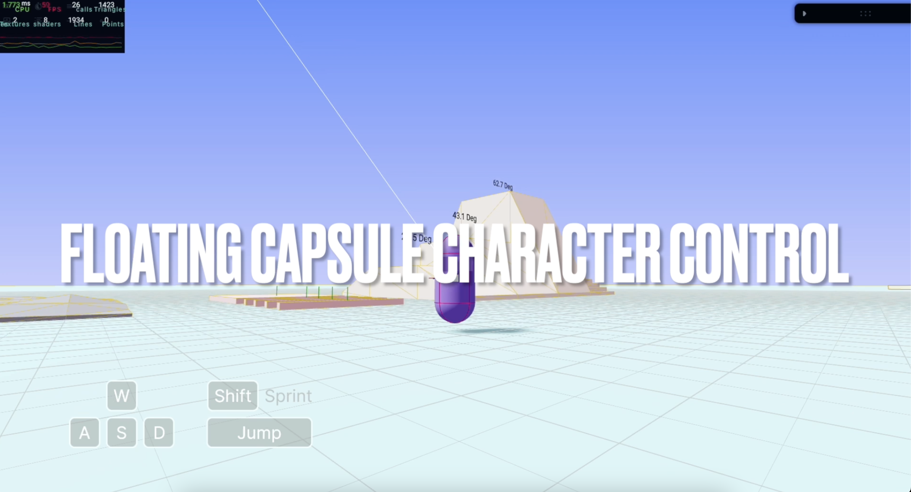
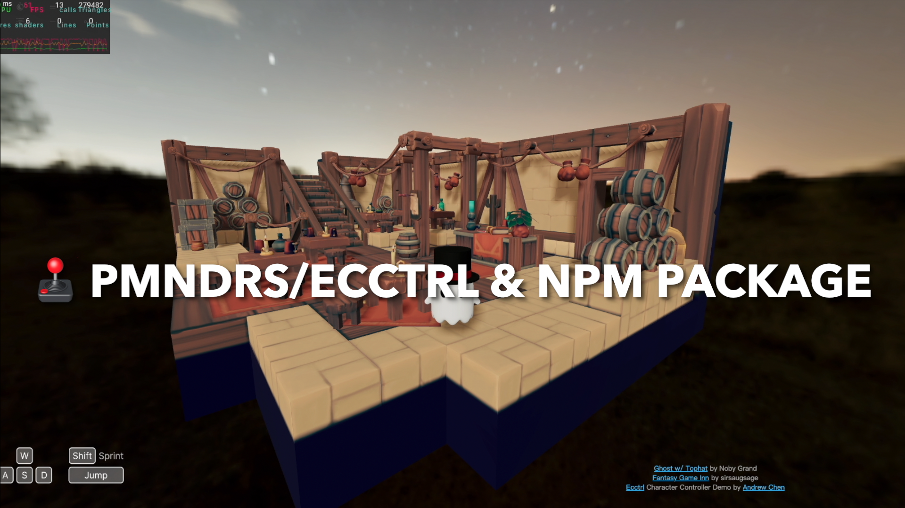

# Ecctrl Floating Capsule Character Controller

[](https://character-control.vercel.app/)

[Pmndrs/ecctrl](https://github.com/pmndrs/ecctrl) is a simple web based character controller build on [react-three-fiber](https://github.com/pmndrs/react-three-fiber) and [react-three-rapier](https://github.com/pmndrs/react-three-rapier). It provides a playground demo where you can experience the following features:

1. Seamless movement over small obstacles
2. Enhanced control with floating force incorporating spring and damping forces
3. Rigidbody character functionality for interaction with the game environment
4. Customizable ground friction for tailored control
5. Realistic simulation with applied mass on supporting surfaces
6. Smooth integration with moving and rotating platforms

## New Features

### (2023-10-02) Pmndrs/ecctrl & npm package:

- The character controller now integrated with [pmndrs/ecctrl](https://github.com/pmndrs/ecctrl)

- You can easily install the npm package using the following command:

```bash
npm install ecctrl
```

To get started, import `Ecctrl` and `EcctrlAnimation`, then wrap your character model within `<Ecctrl>`:

```js
import Ecctrl, {EcctrlAnimation} from 'ecctrl'
...
  <Ecctrl>
    <CharacterModel/>
  </Ecctrl>
...
```

- Additionally, I've prepared a simple [Ecctrl CodeSandbox](https://codesandbox.io/s/ecctrl-w-o-animations-3k3zxt) for online testing and demostration.

- Also, here is another [Ecctrl CodeSandbox](https://codesandbox.io/s/ecctrl-with-animations-nr4493) showcasing character animation functionality.

[](https://codesandbox.io/s/ecctrl-w-o-animations-3k3zxt)

Check out the [featurelog.md](/featurelog.md) for details on previous updates and features.

## Project Link

Live Demo: [Floating Capsule Character Controller](https://character-control.vercel.app/)

## Local Setup

Download [Node.js](https://nodejs.org/en/download). Run this followed commands:

```bash
# Install dependencies (only the first time)
npm install

# Run the local server at localhost:8080
npm run dev

# Build for production in the dist/ directory
npm run build
```

## How To Use

### Basic Controls ([CodeSandbox Demo](https://codesandbox.io/s/ecctrl-w-o-animations-3k3zxt))

```bash
npm install ecctrl
```

```js
import Ecctrl, { EcctrlAnimation } from "ecctrl";
```

To get started, set up your keyboard map using [KeyboardControls](https://github.com/pmndrs/drei#keyboardcontrols). Then, wrap your character model within `<Ecctrl>`:

```js
/**
 * Keyboard control preset
 */
const keyboardMap = [
  { name: "forward", keys: ["ArrowUp", "KeyW"] },
  { name: "backward", keys: ["ArrowDown", "KeyS"] },
  { name: "leftward", keys: ["ArrowLeft", "KeyA"] },
  { name: "rightward", keys: ["ArrowRight", "KeyD"] },
  { name: "jump", keys: ["Space"] },
  { name: "run", keys: ["Shift"] },
  // Optional animation key map
  { name: "action1", keys: ["1"] },
  { name: "action2", keys: ["2"] },
  { name: "action3", keys: ["3"] },
  { name: "action4", keys: ["KeyF"] },
];

return (
  <>
    ...
    <Physics debug={physics} timeStep="vary">
      {/* Keyboard preset */}
      <KeyboardControls map={keyboardMap}>
        {/* Character Control */}
        <Ecctrl>
          {/* Replace your model here */}
          <CharacterModel />
        </Ecctrl>
      </KeyboardControls>
      ...
    </Physics>
  </>
);
```

Here are all the default properties you can play with for `<Ecctrl>`:

```js
// Default properties for Ecctrl
props: {
  children,
  debug: false, // Enable debug mode (require leva package)
  capsuleHalfHeight: 0.35, // Half-height of the character capsule
  capsuleRadius: 0.3, // Radius of the character capsule
  floatHeight: 0.3, // Height of the character when floating
  followLight: false, // Enable follow light mode
  // Follow camera setups
  camInitDis: -5, // Initial camera distance
  camMaxDis: -7, // Maximum camera distance
  camMinDis: -0.7, // Minimum camera distance
  // Base control setups
  maxVelLimit: 2.5, // Maximum velocity limit
  turnVelMultiplier: 0.2, // Turn velocity multiplier
  turnSpeed: 15, // Turn speed
  sprintMult: 2, // Sprint speed multiplier
  jumpVel: 4, // Jump velocity
  jumpForceToGroundMult: 5, // Jump force to ground object multiplier
  slopJumpMult: 0.25, // Slope jump affect multiplier
  sprintJumpMult: 1.2, // Sprint jump multiplier
  airDragMultiplier: 0.2, // Air drag multiplier
  dragDampingC: 0.15, // Drag damping coefficient
  accDeltaTime: 8, // Acceleration delta time
  rejectVelMult: 4, // Reject velocity multiplier
  moveImpulsePointY: 0.5, // Move impulse point Y offset
  camFollowMult: 11, // Camera follow speed multiplier
  // Floating Ray setups
  rayOriginOffest: { x: 0, y: -capsuleHalfHeight, z: 0 }, // Ray origin offset
  rayHitForgiveness: 0.1, // Ray hit forgiveness
  rayLength: capsuleRadius + 2, // Ray length
  rayDir: { x: 0, y: -1, z: 0 }, // Ray direction
  floatingDis: capsuleRadius + floatHeight, // Floating distance
  springK: 1.2, // Spring constant
  dampingC: 0.08, // Damping coefficient
  // Slope Ray setups
  showSlopeRayOrigin: false, // Show slope ray origin
  slopeRayOriginOffest: capsuleRadius, // Slope ray origin offset
  slopeRayLength: capsuleRadius + 3, // Slope ray length
  slopeRayDir: { x: 0, y: -1, z: 0 }, // Slope ray direction
  slopeUpExtraForce: 0.1, // Slope up extra force
  slopeDownExtraForce: 0.2, // Slope down extra force
  // AutoBalance Force setups
  autoBalance: true, // Enable auto-balance
  autoBalanceSpringK: 0.3, // Auto-balance spring constant
  autoBalanceDampingC: 0.03, // Auto-balance damping coefficient
  autoBalanceDampingOnY: 0.02, // Auto-balance damping on Y-axis
  // Animation temporary setups
  animated: false, // Enable animation
  ...props,
}

// Simply change the value by doing this
<Ecctrl maxVelLimit={5} jumpVel={4}>
  <CharacterModel />
</Ecctrl>
```

### Apply Character Animations ([CodeSandbox Demo](https://codesandbox.io/s/ecctrl-with-animations-nr4493))

If you want to apply character animations, prepare the character url and customize the `animationSet` with your own animation names. Change the `Ecctrl` property `animated` to true and wrap your character model inside `<EcctrlAnimation>` tag:

```js
// Prepare character model url
const characterURL = "./ReplaceWithYourCharacterURL";

// Prepare and rename your character animations here
const animationSet = {
  idle: "Idle",
  walk: "Walk",
  run: "Run",
  jump: "Jump_Start",
  jumpIdle: "Jump_Idle",
  jumpLand: "Jump_Land",
  fall: "Climbing", // This is for falling from high sky
  // Currently support four additional animations
  action1: "Wave",
  action2: "Dance",
  action3: "Cheer",
  action4: "Attack(1h)",
};

return (
  <>
    ...
    <Physics debug={physics} timeStep="vary">
      {/* Keyboard preset */}
      <KeyboardControls map={keyboardMap}>
        {/* Character Control */}
        <Ecctrl animated>
          {/* Character Animations */}
          <EcctrlAnimation
            characterURL={characterURL} // Must have property
            animationSet={animationSet} // Must have property
          >
            {/* Replace your model here */}
            <CharacterModel />
          </EcctrlAnimation>
        </Ecctrl>
      </KeyboardControls>
      ...
    </Physics>
  </>
);
```

### (Advanced) Add and Personalize Additional Animations

For advanced animation setups, download all files and follow these steps:

1. In `CharacterModel.jsx`, expand the `animationSet` with additional animations:

```js
// Rename your character animations here
const animationSet = {
  idle: "Idle",
  walk: "Walk",
  run: "Run",
  jump: "Jump_Start",
  jumpIdle: "Jump_Idle",
  jumpLand: "Jump_Land",
  fall: "Climbing",
  action1: "Wave",
  action2: "Dance",
  action3: "Cheer",
  action4: "Attack(1h)",
  //additinalAnimation: "additinalAnimationName",
};
```

2. In `useGame.jsx`, create a trigger function for the new animation:

```js
  return {
      /**
       * Character animations state manegement
       */
      // Initial animation
      curAnimation: null,
      animationSet: {},

      ...

      action1: () => {
        set((state) => {
          if (state.curAnimation === state.animationSet.idle) {
            return { curAnimation: state.animationSet.action1 };
          }
          return {};
        });
      },

      /**
       * Additional animations
       */
      // triggerFunction: ()=>{
      //    set((state) => {
      //        return { curAnimation: state.animationSet.additionalAnimation };
      //    });
      // }
    };
```

3. In `CharacterController.jsx`, initialize the trigger function and call it when needed:

```js
// Animation change functions
const idleAnimation = useGame((state) => state.idle);
const walkAnimation = useGame((state) => state.walk);
const runAnimation = useGame((state) => state.run);
const jumpAnimation = useGame((state) => state.jump);
const jumpIdleAnimation = useGame((state) => state.jumpIdle);
const jumpLandAnimation = useGame((state) => state.jumpLand);
const fallAnimation = useGame((state) => state.fall);
const action1Animation = useGame((state) => state.action1);
const action2Animation = useGame((state) => state.action2);
const action3Animation = useGame((state) => state.action3);
const action4Animation = useGame((state) => state.action4);
//const additionalAnimation = useGame((state) => state.triggerFunction);
```

## Contributions

I appreciate your interest in this project! If you have any feedback, suggestions, or resources related to the controller, please feel free to share.

Thank you!
